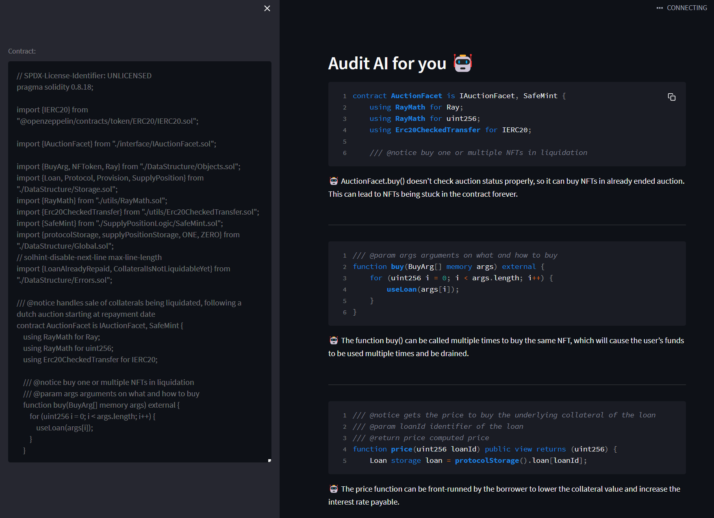

# Auditry with GPT (still developing)

## Getting Started

You will need to clone this repository and install the required dependencies.

  ```
  pip install -r requirements.txt
  ```

To launch the application, you will need to run streamlit in the terminal:

  ```
  streamlit run main.py
  ```

## UI screenshot

  
